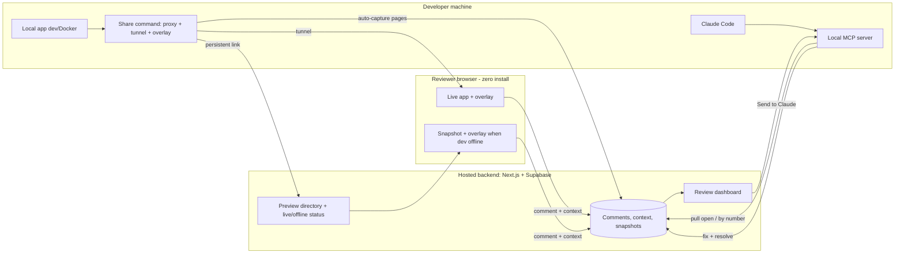

# SuperComment — Team Visual Feedback for AI-Driven Development

## Summary

A team visual-feedback tool: a developer shares their locally-running app through one command, teammates open a persistent managed link and annotate the live UI — or a snapshot when the dev is offline — with zero install, and every comment becomes model-ready context the developer's Claude Code pulls via MCP ("fix all" or "fix #3"), backed by a dashboard to review comments and hand any one to the agent in a click.

---

## Problem Frame

Teams building software with AI coding agents have no good way for a non-author teammate to give precise, actionable visual feedback on an app that is running on someone else's machine.

Today the reviewer screenshots into Slack, records a Loom, or hops on a screen-share. The developer then has to re-locate each element, re-interpret the intent, and hand-translate it into a prompt for their coding agent. Every translation step loses the precise target (which element, which component, which file) and the context (styles, console state) an agent needs to act without guessing.

Existing annotation tools each miss at least one piece: they require the reviewer to be inside the same product/account, require installing something into the app or browser, or produce human-prose output that still has to be reformatted for an agent — and none let a remote teammate review a *localhost* app without the developer manually standing up a tunnel and keeping it alive. The pain concentrates at two moments: the reviewer can't point at the developer's running app, and even when feedback is given it arrives in a form the agent can't directly consume. And if the developer goes offline, the review simply can't happen at all.

The cost is slow, lossy review cycles and feedback that strands as screenshots instead of becoming fixes.

---

## Actors

- A1. Developer (host): runs their app locally, starts sharing with one command, and runs the coding agent that fixes comments.
- A2. Reviewer / teammate: opens the shared link and annotates the UI; either a signed-in team member or a guest identified by name only.
- A3. Coding agent (Claude Code): pulls comments and their context via MCP, makes the fixes, and resolves them.
- A4. Team owner/admin: manages the team, its members, projects, and shareable links (often the same person as A1).

---

## Key Flows

- F1. Start sharing a local app
  - **Trigger:** the developer runs the share command against their running app.
  - **Actors:** A1
  - **Steps:** dev runs one command → a local proxy starts and the tunnel points at it → the annotation overlay is injected into served pages → a persistent managed link is registered/updated and appears on the team dashboard as "live."
  - **Outcome:** a shareable, live, annotatable preview exists and is visible to the team.
  - **Covered by:** R1, R2, R3, R4

- F2. Review and annotate (live or offline)
  - **Trigger:** a reviewer opens the shared link.
  - **Actors:** A2
  - **Steps:** the link opens the live app (dev online) or the latest snapshot (dev offline), overlay present → reviewer selects an element / area / text / multiple elements → writes a note with intent + severity → the comment plus captured context saves to the backend, gets a number, and appears live for the team.
  - **Outcome:** a numbered, model-ready comment is stored and visible to everyone.
  - **Covered by:** R5, R6, R7, R9, R10, R11, R12, R13, R14
  - **Escape path:** if offline and the page has no snapshot yet, the reviewer is told it hasn't been captured (R8).

- F3. Review comments and hand off to the agent
  - **Trigger:** the developer opens the dashboard or prompts the agent.
  - **Actors:** A1, A3
  - **Steps:** dashboard lists comments with intent, context, and status → the developer clicks "Send to Claude" on a comment, or tells Claude Code "fix the open comments" / "fix #3" → the agent pulls the comment(s) + context via MCP → makes the fixes → marks each resolved with a short summary.
  - **Outcome:** targeted comments are fixed in code and marked resolved; status reflects in the dashboard.
  - **Covered by:** R15, R16, R17, R18, R19, R20

- F4. Manage shareable links / previews
  - **Trigger:** the owner opens link/preview management.
  - **Actors:** A4
  - **Steps:** view previews with live/offline status → rename, revoke, regenerate, or set access (team-only vs. open guest link).
  - **Outcome:** links are stable, controllable, and review-ready independent of any single session.
  - **Covered by:** R3, R21, R22

---

## How it fits together (relationship view)

---

## Requirements

*A **preview** = a developer's shared app instance (live, or the latest snapshot) reachable via one persistent managed link, scoped to a project and team.*

**Sharing & access**
- R1. A developer can make a locally-running app shareable with a single command, without modifying the app's code.
- R2. Sharing injects the annotation overlay into served pages so reviewers install nothing (no extension, no package). Injection is framework-agnostic in principle, but v1 commits to a tested set of target stacks plus a documented known-limitations list rather than a blanket "any framework" guarantee — it must handle real dev-server conditions (response compression, streamed/chunked HTML, content-type gating, SPA client-side route changes) and HTTPS-over-localhost realities (mixed-content rewriting, HMR/WebSocket passthrough, CSP rewriting limited to whitelisting the overlay). *[Spike before committing.]*
- R3. Each shared app has a persistent, stable link that survives dev-server restarts and does not change between sessions. The stable URL is owned by the hosted backend and mapped to the current tunnel each session; the Cloudflare quick-tunnel default cannot itself provide a stable URL, so the routing approach (backend-proxied live traffic vs. named tunnel vs. thin-shell redirect — each with different cost/topology) must be chosen by an early spike. *[Spike before committing.]*
- R4. The team dashboard shows each shared preview with a live/offline status that updates automatically (via a heartbeat from the local helper) when the developer starts or stops sharing, and flips to offline after a missed-heartbeat threshold when the machine sleeps or loses network.
- R5. Reviewers can open a shared link as a guest (name only, no signup) or as a signed-in team member; developers/owners have accounts.

**Offline persistence**
- R6. While a preview is live, the pages reviewers visit are automatically captured as snapshots that preserve enough page structure (DOM + styles) to annotate later. *[Capture technique: spike before committing.]*
- R7. When the developer is offline the link serves the latest snapshot (still annotatable); when online it serves the live app. Offline-captured comments are snapshot-fidelity — they carry selector, frozen surrounding HTML, styles, and screenshot, but not live-only React component/source mapping, and are tagged as such.
- R8. If a reviewer opens an offline preview for a page with no snapshot yet, the tool clearly says that page hasn't been captured (and offers the pages that were captured) rather than showing a broken page.

**Annotation & context capture**
- R9. Reviewers can annotate by clicking a single element, dragging an area/region, selecting text, or selecting multiple elements at once.
- R10. Each comment records the reviewer's note plus an intent (e.g., fix / change / question) and a severity.
- R11. Each comment captures model-ready context for any framework: at minimum the element selector, computed styles, surrounding HTML, position, page URL/viewport, relevant console errors, and a screenshot.
- R12. For React apps, comments additionally capture the component path (via the runtime fiber tree) and, when the dev build emits source metadata, the source file:line. Coverage varies by React version and toolchain (React 19 / SWC / the new JSX transform may not expose source location to a pure-runtime reader); where unavailable, capture degrades gracefully to component path + selector. Whether an optional dev plugin is offered for reliable source mapping is a planning decision. *[Spike before committing.]*
- R13. Every comment gets a number that is unambiguous within its shared preview. Numbers are allocated atomically per preview (safe under concurrent guest/member writes), are monotonic, and are never reused or renumbered after resolve/dismiss, so "fix #3" stays unambiguous.

**Collaboration & dashboard**
- R14. New comments appear for everyone currently viewing in near-real-time.
- R15. A dashboard lists all comments for a project with note, intent, severity, captured context, status, number, and author (with a visible guest vs. member distinction).
- R16. Comments have a lifecycle: open → resolved (the issue was fixed — by agent or developer, optionally with a summary) or dismissed (acknowledged but won't be acted on, with an optional reason). Both remove the marker from the live overlay and keep the comment in dashboard history, visually distinguished. Only developers/owners change status; reviewers cannot.

**Agent handoff (MCP)**
- R17. The developer's coding agent (Claude Code) can pull open comments and their full context for the current project via MCP, on demand. The "current project" is resolved from a local project-binding (project id + scoped credential) created at first share.
- R18. The agent can act on all open comments or on a specific numbered comment.
- R19. After fixing, the agent can mark a comment resolved (optionally with a short summary), reflected in the dashboard.
- R20. From the dashboard, a user can hand a single comment to the agent in one click ("Send to Claude"). Because a hosted page cannot push directly to a local process, this enqueues the comment to the project's queue (delivered to the local helper over its authenticated outbound channel — the same channel that carries live/offline status and link registration); the developer's agent consumes the queued item on its next pull. The dashboard shows sent / working / failed states. *[Channel mechanism: spike before committing.]*

**Link & team management**
- R21. An owner can manage a preview's link: rename, revoke, regenerate, set access (team-only vs. open guest link), and set expiry.
- R22. Comments and previews are scoped to a project (mapping to the developer's app) and to the team allowed to see them.

**Security & trust**
- R23. Guest-submitted comments are treated as untrusted input to the agent: they are never auto-included in an agent batch ("fix all"), the developer must explicitly confirm before any guest comment is handed to the agent, and every comment carries a visible trust level (guest vs. verified member) in the dashboard and in the MCP payload. (Mitigates prompt-injection into the coding agent via guest comment text.)
- R24. Sharing defaults to team-only access; open guest links are opt-in, carry an unguessable secret in the URL, support expiry, and at share time the developer is shown what is being exposed. Guest display names are cosmetic; a stable server-side identifier is the authoritative identity, and a guest name may not impersonate an existing member.
- R25. The local helper/MCP server binds to loopback only and requires an authenticated token for all calls; the hosted backend reaches the local helper only over an outbound, developer-authorized channel — never an inbound connection to the dev machine.
- R26. Captured snapshots, surrounding HTML, console output, and screenshots are treated as sensitive: a redaction pass strips common secret patterns before storage, console capture is opt-in, snapshots carry a retention limit, and all comment/snapshot data is tenant-isolated per team in the backend (row-level security), readable only by authorized viewers.

---

## Acceptance Examples

- AE1. **Covers R7.** Given a developer shared a preview and then stopped their dev server, when a reviewer opens the link, the latest captured snapshot is shown and is annotatable.
- AE2. **Covers R7.** Given the developer's app is running and shared, when a reviewer opens the link, the live interactive app is shown with the overlay present.
- AE3. **Covers R8.** Given a preview is offline and a page was never visited while live, when a reviewer navigates to that page, they see a clear "this page hasn't been captured yet" message instead of a broken page.
- AE4. **Covers R13, R18.** Given three open comments numbered 1–3, when the developer tells the agent "fix #2", only comment #2 is acted on and the others remain open.
- AE5. **Covers R11, R12.** Given a React app whose dev build emits source metadata, when a reviewer comments on a button, the captured context includes the component path and source file:line; given a non-React app (or a build without source metadata), the comment still includes the full generic context (selector, computed styles, surrounding HTML, position, URL/viewport, console errors, screenshot) but no component/source mapping.
- AE6. **Covers R16, R19.** Given an open comment, when the agent marks it resolved, it disappears from the live overlay but remains in the dashboard history with resolved status.
- AE7. **Covers R4.** Given a developer stops sharing, when a teammate looks at the dashboard, the preview shows as offline within a short time.
- AE8. **Covers R5.** Given an open guest link, when a person with no account opens it and enters a name, they can leave comments attributed to that name.

---

## Success Criteria

- A teammate can go from "I see something wrong" to a stored, precise, model-ready comment on the developer's app in well under a minute, with nothing to install.
- Review is not blocked by the developer being offline for any page captured while live — reviewers can view and annotate the latest snapshot (uncaptured or highly dynamic pages may be unavailable; offline comments are snapshot-fidelity).
- A developer goes from install to a working shared link in a few minutes via a single command, without hand-wiring a tunnel or MCP server.
- The developer can clear a batch of comments by telling Claude Code "fix the open comments," and the agent has enough context to make correct edits without asking the reviewer to re-explain.
- A specific comment can be fixed by number with no ambiguity.
- Downstream-agent handoff: context pulled via MCP is complete enough that the agent rarely needs to re-locate the element or guess intent (selector/component/file + intent + severity + screenshot present).

---

## Scope Boundaries

### Deferred for later

- Autonomous agent loops (hands-free / self-driving — the agent acting without being asked); v1 is pull-on-demand only.
- A generic "copy model-ready prompt" path for non-Claude-Code agents (Cursor, ChatGPT, etc.).
- A deeper opt-in plugin for non-React component/source mapping and maximum-fidelity capture.
- Always-on hosted-preview / deploy-a-build mode (snapshot fallback covers offline review for v1).
- Webhooks and GitHub / Slack / Linear ticketing integrations.
- Figma-style presence cursors; video/voice huddles.
- Mobile-browser reviewing.
- Billing, pricing tiers, and per-team self-hosting / on-prem.

### Outside this product's identity

- A general-purpose website feedback / bug-tracker widget for *production end-users* — this is a dev-time tool for teams building with AI agents, not a production feedback widget.
- A replacement for the coding agent — SuperComment feeds the agent; it does not make the code edits itself.
- A design / wireframing authoring tool — it captures feedback on what exists rather than authoring net-new layouts (this is why layout/wireframe mode is excluded, not merely deferred).

---

## Key Decisions

- **Overlay via proxy-injection** (not an npm component or browser extension): zero install for reviewers and framework-agnostic. The rich React context Agentation provides is runtime data we can read the same way, so injection does not sacrifice it.
- **Tiered context** (generic always; React-dev adds component + source; deeper plugin later): captures nearly all the value with zero install for the common case, and defers the cost of universal source mapping.
- **Persistent managed link + snapshot fallback** (not stable-link-only, not deploy-a-build): keeps the localhost-simple workflow while guaranteeing review works when the dev is offline.
- **Hosted backend + lightweight local helper**: one shared source of truth so links and comments stay consistent across the team, and the fix loop is decoupled from whether the tunnel is up.
- **Cloudflare Tunnel as default transport**: free, no account needed for quick tunnels, instant HTTPS; swappable later.
- **Pull-on-demand MCP + one-click dashboard handoff** (not auto-watch): keeps the developer in control for v1; the MCP surface is designed so a watch/hands-free mode can be added later.
- **Next.js + Supabase**: full-stack speed with auth, Postgres, and realtime out of the box for the team and live-sync needs.
- **Scope**: all v1 requirements (R1–R26) ship in the first release (no fast-follow split). The build is internally sequenced from the core loop outward, but everything is in scope.
- **Clean-room build (strict)**: implement primarily from public-docs research + standard, well-known techniques (runtime fiber reading, selector generation, HTML-injecting proxy, MCP). If a specific edge case genuinely cannot be resolved from public sources, a narrow strict Chinese-wall study of that aspect is allowed — study behavior/logic only, write it up in our own words, and copy no code, UI, structure, or naming. Independent creation remains the goal.

---

## Dependencies / Assumptions

- Reviewed apps run in development mode (the overlay and dev-mode React metadata depend on it; this is a dev-time tool).
- The developer can run a local helper process (CLI) alongside their app or Docker container.
- The chosen tunnel transport (Cloudflare by default) is reachable from the developer's machine.
- Snapshot fidelity is "good enough to annotate," not a perfect interactive replica; dynamic or auth-gated content may capture imperfectly.
- A hosted Supabase project is available as the shared backend.

---

## Outstanding Questions

### Resolve Before Planning

- (none — resolved at review handoff: all v1 requirements ship together; clean-room build is public-docs-first with a strict, narrow Chinese-wall fallback. See Key Decisions.)

### Resolve early in planning (spikes — premises that can invalidate requirements)

- [Affects R3] Persistent stable-URL routing: backend-proxied live traffic vs. named tunnel vs. thin-shell redirect — decides cost, topology, CSP, and WebSocket handling.
- [Affects R2] Overlay injection across target stacks: compression, streamed/chunked HTML, content-type gating, SPA route changes, mixed-content rewriting, HMR/WebSocket passthrough, and CSP rewriting (whitelist overlay only).
- [Affects R11, R12] Runtime technique and React-version/toolchain coverage for component path + source file:line; define graceful degradation; decide whether an optional dev plugin is offered.
- [Affects R6, R7] Snapshot capture technique (DOM serialization vs. screenshot + element-map), handling of dynamic/auth-gated pages and external assets; capture React/source context at capture time (it is live-only).
- [Affects R20] The authenticated outbound channel from the local helper, and how "Send to Claude" enqueues to the agent.

### Deferred to Planning

- [Affects R13, R16, R17] Selector drift when code changes before a fix; prefer component+source over selector; re-resolve selectors against the live DOM before the agent acts.
- [Affects R17, R22] Project-identity binding between the local repo and the hosted preview, and the developer-scoped credential the MCP server uses.
- [Affects R23-R26][Security] Detailed threat model: redaction patterns, RLS policies, guest-link abuse/rate-limiting, and the agent-injection confirmation UX.
