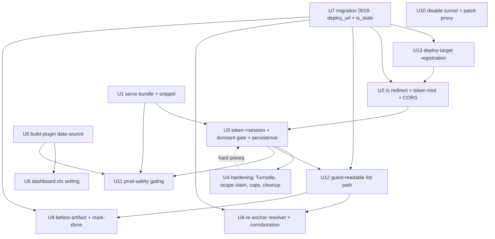

# feat: Embedded Deployed Review Mode

## Summary

Ship the "deployed" mode: serve the existing overlay IIFE from the web app behind a customer-added script tag, make the overlay dormant-by-default and token-gated, turn `/s/<slug>` into a first-party identity hop that mints a short-lived token exchanged for a preview-scoped Supabase session so reads/writes authorize via JWT, add a preview-only `data-source` build stamp for exact `file:line`, and build the full redeploy-reconcile loop (read existing comments, re-anchor, before/after, persist until done) on a new guest-readable path — while disabling the CLI tunnel entry behind a flag without deleting it.

---

## Problem Frame

A shared review link must survive the developer going offline and stay fully interactive, which the localhost tunnel cannot do (`/s/<slug>` 503s when the heartbeat stops). The fix is to embed the overlay in the developer's own always-on deployed preview. Full situational context and product decisions live in the origin: `docs/brainstorms/2026-06-28-supercomment-embedded-deployed-review-mode-requirements.md`.

Research + document review surfaced realities this plan must honor: (1) the overlay currently **auto-mounts unconditionally** and is **write-only** (it has no path to *read back* existing comments); (2) on this branch `/s/<slug>` is still a **reverse proxy** with no access gate, `safeNextPath`/plan-002 are **not applied**, and migrations reach `0015` with `0012–0014` reserved (so the next migration here is `0016`); (3) this repo is **React 19.2 / Next 16.2**, where `_debugSource`/`jsxDEV` source args are gone — so `file:line` must come from a **build-time attribute stamp**; (4) the **redeploy-reconcile loop is the differentiator and is the least-built part** — it needs a guest-readable comment list, a live session that survives reload, reliable re-anchoring, and a real "before" artifact.

---

## Requirements

**Delivery & activation**
- R1. Overlay delivered as an embedded script in the developer's own deployed build, on the app's own origin.
- R2. Overlay stays dormant/inert unless a valid review session is active.
- R3. `/s/<slug>` activates a review via redirect carrying a short-lived token; overlay validates it, establishes a review-scoped session, persists it for navigation/reload, strips the token from the URL.
- R4. Reviewer performs no setup.

**Identity & access**
- R5. First-party identity resolution at the `/s` hop: team member attributed to themselves; account-less visitor admitted as a link-secret-scoped guest.
- R6. `team_only` requires login before activation; `guest_link` admits guests; one link auto-detects.
- R7. Guest sessions scoped to the specific review; honor expiry + secret-rotation.

**Code context & AI hand-off**
- R8. Every comment captures richest live code context against the real running app.
- R9. Universal script tag (floor) + optional per-framework build plugin adding exact `file:line`.
- R10. Dashboard "enhanced code context" setting: auto-detect file:line, setup steps, gate file:line in hand-off.
- R11. Developer reviews a comment with full context and hands it to an AI agent with that context attached.

**Comment lifecycle & redeploys**
- R12. Comments persist across redeploys and are readable back into the overlay on the live preview.
- R13. On a new deploy, re-anchor via the multi-anchor system; mark stale (but keep visible) when the element is gone or ambiguous.
- R14. Each comment records provenance (deploy/commit + captured context) at creation.
- R15. Each comment shows its capture-time "before" artifact (element screenshot or snapshot).
- R16. Comments remain active until explicitly marked done.

**Tunnel deprecation & production safety**
- R17. Tunnel mode disabled behind a flag; code retained intact (and patched for the known proxy bugs before retention).
- R18. Overlay never activates for production end-users: build-time exclusion + runtime token gate.

**Origin actors:** A1 Developer, A2 Team-member reviewer, A3 Guest reviewer, A4 AI coding agent.
**Origin flows:** F1 One-time install, F2 Share and activate, F3 Comment + hand off, F4 Redeploy and reconcile.
**Origin acceptance examples:** AE1 (R2,R18), AE2 (R3,R4,R5), AE3 (R5), AE4 (R6), AE5 (R12,R13,R15), AE6 (R13), AE7 (R9,R10), AE8 (R16).

---

## Scope Boundaries

- Re-enabling tunnel functionality — code retained (and bug-patched), dormant (R17).
- Non-React framework build plugins — the universal script tag covers them at component-name fidelity.
- Hosting the customer's app/infrastructure; browser-extension delivery; new Jira/Linear integrations.
- Static-snapshot-only offline serving as a primary path — the snapshot system is reused only as the before-state fallback.
- Rewriting the customer's CSP — handled via install docs, not code.

### Deferred to Follow-Up Work

- `@supercomment/next` convenience wrapper that auto-injects the snippet + wires the build plugin (v1 ships the publishable Babel plugin + documented config + script-tag wiring).
- A CI registration endpoint for `deploy_url`/commit (v1 supports dashboard manual registration; CI auto-registration is the next increment).
- Server-side persistence of computed `stale` state (v1 computes stale at render).

---

## Context & Research

### Relevant Code and Patterns

- Overlay seam: `apps/overlay/src/index.ts` (unconditional auto-mount + `window.__SUPERCOMMENT__`), `apps/overlay/src/controller.ts` (mount/`destroy`; markers added only on submit — no read path), `apps/overlay/src/core/types.ts` (`OverlayConfig`, `CommentSubmitter`), `apps/overlay/src/submit/index.ts` (raw-fetch submitter; `linkSecret` structurally required; no supabase-js), `apps/overlay/src/markers/` (`MarkerLayer.add({number,rect})` — no anchor/stale input today).
- Capture: `apps/overlay/src/capture/anchors.ts` (multi-anchor set; **capture only — no resolver**; role/text/dom-path are non-unique), `apps/overlay/src/capture/screenshot.ts` (returns `null` without an injected rasterizer), `apps/overlay/src/snapshot/capture.ts` (whole-document serializer — not element-scoped).
- Share/auth: `apps/web/app/s/[slug]/[[...rest]]/route.ts` (reverse proxy; forwards all headers incl. cookies — plan-001 bug), `apps/web/app/auth/callback/route.ts` (raw `${origin}${next}` — plan-002 open redirect, **unpatched**), `apps/web/app/login/actions.ts` (hardcodes `/dashboard`; `next` unused), `apps/web/lib/link.ts` (`buildGuestUrl` emits `?k=<secret>`), `apps/web/lib/supabase/middleware.ts` (`getClaims`; `/s/` excluded from matcher). `safeNextPath`/`apps/web/lib/safe-redirect.ts` **does not exist on this branch**.
- Comments/RLS: `supabase/migrations/0001_schema.sql`, `0002_rls.sql` (comment SELECT + realtime are `authenticated`-only — **no guest read**), `0003_rpcs.sql` (`create_guest_comment` validates `p_link_secret`; `resolve_comment`/`dismiss_comment`), `0011_register_preview_tunnel.sql` (`register_preview_tunnel` — only writer of the deploy target, member-only via CLI), `packages/shared/src/schema.ts`. Dashboard `comments/{comment-card,context-detail,lifecycle-controls,status-badge,send-to-claude-button}.tsx`, `apps/web/lib/data.ts` (`PreviewRow` has no `deploy_url`), `apps/web/next.config.ts` (exists; has `transpilePackages`).
- CLI: `apps/cli/src/bin/index.ts` (`case "start"` dispatch — disable seam; tests call `runStart` directly so they survive the gate), `apps/cli/src/proxy/csp.ts` (CSP knowledge → docs).

### Institutional Learnings

- No `docs/solutions/`; executed `plans/001–008` are the de-facto learnings. Load-bearing: `plans/001` (redirect; access-before-liveness; never-forward-viewer-headers; URL allowlist for SSRF — **the proxy code still has the cookie-forward + SSRF bugs**), `plans/002` (`safeNextPath` + auth-callback fix — **not applied on this branch**), `plans/007` (server-side rate-limit 20/min + payload cap belong in the RPC; `create or replace` signature-match gotcha — and `0013 guest_abuse_hardening` is **already applied to the dev DB** by the hardening branch), `plans/004` (rotate secrets, strip from URL), `plans/008` (capture-phase listener teardown).
- The hardening branch has **already applied `0012` (share access gate + tunnel allowlist), `0013` (guest abuse hardening), `0014` (team invites)** to the dev DB though they're absent from this branch's tree — coordinate to avoid duplicate/colliding RPCs.

### External References

- React 19.2 removed runtime source info → build-time `data-*` stamp, read via `el.closest()`, strip in prod via `compiler.reactRemoveProperties`; Next 16 Turbopack auto-runs Babel when a config is present (`turbopackUseBuiltinBabel`). Model on `@locator/babel-jsx` / `@react-dev-inspector/babel-plugin`. Gate on `NEXT_PUBLIC_VERCEL_ENV`.
- Security (RFC 9700, Supabase passwordless + anonymous sign-in, Vercel Toolbar gating): short-lived single-use token → scoped session; strip from URL synchronously before the exchange fetch; bearer JWT over CORS (never third-party cookies); Turnstile + rate-limit + RLS-by-claim; scope the session to the preview server-side; schedule anonymous-user cleanup. Turnstile needs `script-src`/`frame-src challenges.cloudflare.com` in the customer CSP.

---

## Key Technical Decisions

- **Embedded snippet over proxy injection; redirect over reverse-proxy for `/s`.** App runs on its own origin; the embedded `/s` branch redirects with a token. Proxy code stays for the dormant tunnel path — **but is bug-patched first** (strip `authorization`/`cookie`/`sb-*` on forward; tighten tunnel-URL validation) so re-enabling the flag doesn't restore the plan-001 SSRF/credential-leak bugs.
- **Token → preview-scoped session, full hardening in v1.** Mint a short-lived single-use token at the `/s` hop; exchange it (with Turnstile) for a **preview-scoped** session — anonymous Supabase session for guests, and a **preview-scoped (not full) session for members** so a member credential is never handed wholesale to a third-party origin. Writes authorize on the session's `preview` claim. **U4 (scope claim + caps) is a hard prerequisite of shipping U3's write path** — never deploy the write path without the scope guard (closes the cross-preview-write window).
- **Guest link-secret stays first-party; never forwarded.** The share link to `/s` keeps the secret (validated server-side at mint); the secret is **never** forwarded to the customer origin (only the short-lived token is). This preserves the guest gate + rotation semantics (R7) while removing URL-leakage to third parties. Rotation invalidates future mints; existing sessions die on expiry.
- **CORS is a real custom surface.** The mint + exchange endpoints are cross-origin Next routes; they need preflight (`OPTIONS`) + `Access-Control-Allow-Origin` **reflected dynamically against the deploy-URL allowlist** (not `*`), with `Vary: Origin`. (Corrects the earlier "no custom CORS surface" assumption — that was only true of Supabase's own REST/Auth.)
- **Deploy-URL allowlist is explicit:** HTTPS-only, no IP literals, no localhost; host must match a registered value (known preview-CDN patterns — `*.vercel.app`, `*.netlify.app`, `*.pages.dev`, `*.fly.dev`, `*.onrender.com` — or an explicitly registered custom domain). Prevents token theft via a malicious `deploy_url`.
- **`file:line` via preview-only build-time `data-source` stamp,** read with `el.closest()`; not fiber/`__source`. Universal script tag is the floor; plugin is progressive enhancement.
- **Read/reconcile is a first-class build, not an extension.** A new guest-readable list path (RPC + RLS SELECT scoped to the review session's preview) feeds an overlay read-on-activate render; markers become stale-capable; re-anchoring requires **multi-anchor corroboration** (a single non-unique anchor like `role`/`text` resolves to stale, not a guess).
- **Session persistence is mandatory** (sessionStorage + a raw-fetch refresh path), since reload is exactly what triggers reconcile; the token is stripped, so reactivation relies on the persisted session, not the URL.
- **"Before" artifact = per-comment element snapshot captured at submit** (best-effort element raster, element-subtree DOM snapshot as fallback) wired into `completeSubmit` — not a deferred full-page rasterizer.
- **`stale` is a separate marker, not a `comments.status` value.** Provenance lives in `context` jsonb; `previews.deploy_url` + `comments.is_stale` are new columns (migration `0016`).
- **Coordinate with the hardening branch:** inspect the already-applied `0012–0014`; **extend** the existing hardened RPCs/allowlist rather than rebuild; pin signatures to avoid `create or replace` overload collisions.

---

## Open Questions

### Resolved During Planning

- Source of `file:line`: build-time `data-source` stamp.
- Cross-origin transport: bearer session JWT + an explicit CORS surface on our mint/exchange routes (allowlist-reflected ACAO).
- Guest access model: secret stays first-party at `/s`, never forwarded; slug is not the sole gate.
- Session lifetime: persisted (sessionStorage) + refresh; survives reload/reconcile.
- "Before" artifact: per-comment element snapshot at submit.
- Read path: new guest-readable scoped list RPC + RLS + overlay render.
- Preview scoping: server-side claim/guard; U4 is a hard prereq of U3.
- Next migration on this branch: `0016`.

### Deferred to Implementation

- Exact token encoding (opaque + server map vs signed JWT) and single-use store; TTL within 30–120s.
- Whether preview scoping rides a custom access-token-hook claim or a server-side token→{preview,role} map — both must enforce server-side; pick during impl.
- Exact mechanism feeding deploy commit/URL into the build (env at build time) and graceful degradation when absent.
- Anchor-corroboration scoring threshold (how many anchors must agree).
- Rasterizer library for the best-effort element raster (and the cross-origin/WebGL blanks it accepts).

---

## High-Level Technical Design

> *This illustrates the intended approach and is directional guidance for review, not implementation specification.*

Activation + write/read flow (F2/F3/F4):

```mermaid
sequenceDiagram
  participant R as Reviewer (browser)
  participant S as supercomment.com /s/<slug>
  participant A as SuperComment mint/exchange API
  participant D as Customer deploy (preview)
  participant O as Overlay (embedded, dormant)
  participant SB as Supabase

  R->>S: GET /s/<slug> (secret first-party, if guest)
  S->>S: validate secret + resolve identity + access_mode + deploy_url (allowlist)
  alt team_only & not logged in
    S-->>R: 307 /login?next=/s/<slug>  (safeNextPath)
  else allowed
    S->>S: mint short-lived single-use, preview-scoped token (rate-limited)
    S-->>R: 307 -> deploy_url#sc_token  (Referrer-Policy: no-referrer)
  end
  R->>D: GET preview (token in fragment)
  D-->>O: page + embedded snippet (preview build only)
  O->>O: read token synchronously; history.replaceState strip
  O->>A: exchange token (+Turnstile) [CORS: ACAO=deploy_url]
  A->>SB: mint preview-scoped session (anon guest / scoped member)
  A-->>O: session JWT (preview claim); overlay persists it (sessionStorage)
  O->>SB: list_review_comments(preview) via JWT  (RLS by claim)
  O->>O: re-anchor each (multi-anchor corroboration); render markers + stale
  O->>SB: write/resolve via JWT (RLS + caps)
```

Unit dependency graph:



---

## Implementation Units

### Phase A — Foundation, delivery & secure activation

- U7. **Migration 0016: provenance + stale + deploy target** *(moved to Phase A — it is the foundation U2/U3/U12 build on)*

**Goal:** Schema for the embedded model: `previews.deploy_url`, `comments.is_stale`, and per-comment provenance in `context`.

**Requirements:** R12, R14

**Dependencies:** None

**Files:**
- Create: `supabase/migrations/0016_embedded_review_schema.sql` (`previews.deploy_url text`; `comments.is_stale boolean default false`)
- Modify: `packages/shared/src/schema.ts` (`CapturedContext` provenance: `deployUrl?`, `commit?`)
- Modify: `apps/web/lib/data.ts`, `apps/web/lib/comments/{types,transform}.ts`
- Test: `supabase/tests/embedded_schema.test.sql`

**Approach:** Status enum unchanged; `is_stale` orthogonal. Inspect the already-applied `0012–0014` first so columns/policies don't collide.

**Test scenarios:**
- Happy path: new columns default correctly; provenance round-trips through `context`.
- Edge: existing guest insert / member read still pass under new columns (no RLS regression).

**Verification:** Columns exist, typed end-to-end; existing comment flows green.

---

- U13. **Deploy-target registration** *(new — closes the "nothing writes deploy_url" gap)*

**Goal:** Let a member register/update a preview's `deploy_url` (and optional commit) so `/s` has a redirect target in embedded mode; define provenance-absent degradation.

**Requirements:** R3, R14

**Dependencies:** U7

**Files:**
- Create: `supabase/migrations/0017_register_deploy_target.sql` (member-only `register_deploy_target(preview, url, commit?)`, validates URL against the allowlist)
- Modify: dashboard preview settings (`apps/web/app/(dashboard)/dashboard/previews/[previewId]/link-manager.tsx`) to set the deploy URL
- Test: `supabase/tests/register_deploy_target.test.sql`, `apps/web/__tests__/deploy-target.test.ts`

**Approach:** Mirror `register_preview_tunnel` (member-gated, security-definer) but for the stable deploy URL + allowlist validation. Commit/provenance is best-effort; when absent, comments still save and the dashboard shows "no commit recorded."

**Test scenarios:**
- Happy path: member registers an allowlisted HTTPS deploy URL; `/s` can resolve it.
- Error path: non-allowlisted/IP/localhost/non-HTTPS URL rejected.
- Edge: provenance absent → comment still records, degradation visible.

**Verification:** A preview can be pointed at a deploy URL; `/s` redirects there.

---

- U1. **Serve overlay bundle from the web app + universal install snippet**

**Goal:** Host the built overlay IIFE at a cache-busted URL from `apps/web` and provide the documented universal `<script>` snippet.

**Requirements:** R1, R9 (floor), R4

**Dependencies:** None

**Files:**
- Modify: `apps/overlay/tsup.config.ts` (emit a content-hashed filename)
- Create: a build step copying `apps/overlay/dist` into `apps/web/public/` (so Next output-file-tracing includes it) + `apps/web/app/sc-loader/route.ts` (tiny `no-store` loader)
- Create: `docs/embed/install.md`
- Test: `apps/web/__tests__/overlay-asset.test.ts`

**Approach:** Do **not** read a sibling package's `dist/` at request time (not traced into the serverless bundle). Use a `public/` copy (hashed → `immutable`) + a small loader served `no-store`. The loader reads the token synchronously (see U3).

**Test scenarios:**
- Happy path: hashed bundle served with `immutable`; loader served `no-store`.
- Edge: missing build → clear error, not empty 200.

**Verification:** A plain HTML page with the snippet loads the overlay from the web app.

---

- U2. **`/s/<slug>` redirect + identity + token mint (CORS, allowlist, rate-limit)**

**Goal:** Embedded branch on `/s` that validates the guest secret first-party, resolves identity, and redirects to the allowlisted `deploy_url` with a short-lived single-use token. Keep the (now bug-patched) proxy code for the dormant tunnel path.

**Requirements:** R3, R5, R6, R7

**Dependencies:** U7, U13

**Files:**
- Modify: `apps/web/app/s/[slug]/[[...rest]]/route.ts` (embedded redirect vs legacy proxy)
- Create: `apps/web/lib/share-access.ts` (member/guest/login decision; access-before-liveness; validate first-party secret)
- Create: `apps/web/lib/safe-redirect.ts` (`safeNextPath`, same-origin only) **and** wire `?next` consumption in `apps/web/app/login/actions.ts` + `apps/web/app/auth/callback/route.ts` (this also patches the plan-002 open redirect)
- Create: `apps/web/lib/external-redirect.ts` (deploy-URL allowlist validator)
- Create: `apps/web/app/api/review-token/route.ts` (mint; rate-limited per slug+IP; CORS preflight + allowlist-reflected ACAO)
- Modify: `apps/web/lib/link.ts` (keep the secret on the first-party `/s` link; never forward it)
- Test: `apps/web/__tests__/{share-access,external-redirect,safe-redirect,review-token-mint}.test.ts`

**Approach:** `team_only` + no session → 307 `/login?next=/s/<slug>` (via `safeNextPath`). Allowed → mint token, 307 to `deploy_url#sc_token`, `Referrer-Policy: no-referrer`. Token in the **fragment** (not query). Secret validated at mint; never placed on the deploy redirect.

**Execution note:** Test-first for the three identity outcomes (member / guest / login-required) and the allowlist refusal.

**Test scenarios:**
- Covers AE4. `team_only` + no session → `/login?next=/s/<slug>`; after login returns to `/s/<slug>` (round-trip).
- Covers AE2/AE3. `guest_link` (valid secret) → 307 to `deploy_url#sc_token`; member → token encodes member identity.
- Error path: bad/absent guest secret → refused; unknown slug → 404; expired → expired page.
- Security: `deploy_url` not in allowlist → refuse (no open redirect/SSRF); `?next=@evil.com` / `//evil` rejected by `safeNextPath`; secret never appears in the deploy redirect or any response body.
- Edge: >N mint calls per slug+IP/min → 429.
- CORS: preflight from an allowlisted origin succeeds; from an unlisted origin fails.

**Verification:** Clicking a link lands the reviewer on the deploy with a fragment token; team-only bounces through login and back; bad deploy URLs are refused.

---

- U3. **Token → preview-scoped session, dormant gate, persistence, write-via-JWT**

**Goal:** Overlay dormant by default; on load read+strip the token synchronously, exchange it (CORS) for a **preview-scoped** session (anon guest / scoped member), persist it, and submit via the session JWT.

**Requirements:** R2, R4, R5, R7, R8, R18 (runtime gate)

**Dependencies:** U1, U2; **U4 is a hard security prerequisite for production** (scope claim + caps must exist before the write path is live)

**Files:**
- Modify: `apps/overlay/src/index.ts` (remove unconditional auto-mount; gate on a valid session)
- Create: `apps/overlay/src/auth/session.ts` (read fragment **synchronously before any async work**, `history.replaceState` strip, exchange, persist in `sessionStorage`, raw-fetch refresh before access-token expiry)
- Create: `apps/overlay/src/submit/session.ts` (JWT submitter; retain `SupabaseCommentSubmitter` for the dormant tunnel path) + modify `apps/overlay/src/submit/index.ts` (`submitterFromBootConfig` selects by mode)
- Create: `apps/web/app/api/review-token/exchange/route.ts` (validate single-use token, mint preview-scoped session; CORS preflight + allowlist-reflected ACAO)
- Create: `supabase/migrations/0018_embedded_review_rpcs.sql` (`create_*_comment` authorizes on the session's `preview` claim)
- Test: `apps/overlay/src/auth/session.test.ts`, `apps/overlay/src/submit/session.test.ts`, `supabase/tests/embedded_comment.test.sql`

**Approach:** No token → never mount (no shell, no listeners). Token → strip synchronously in the loader tick (before Turnstile/exchange so error reporters can't capture it), exchange, persist, mount. Keep the bundle supabase-js-free (raw fetch for anon sign-in, exchange, refresh, RPC). Member session is **preview-scoped**, not a full member credential, so nothing privileged leaks to the customer origin.

**Execution note:** Test-first for dormant-vs-active (AE1), synchronous URL-strip, and reload-survival.

**Test scenarios:**
- Covers AE1. No token → overlay never mounts; no listeners bound.
- Covers AE2. Valid guest token → preview-scoped anon session; toolbar mounts; token removed from `location` synchronously.
- Edge: reload after activation → session restored from `sessionStorage`, toolbar returns without a token (R3).
- Edge: access token near expiry → refresh succeeds before the next write.
- Error path: expired/invalid/reused token → dormant, no partial UI, no host-page throw.
- Integration: submit uses the session JWT (no anon-key bearer, no link-secret in body) and is rejected if the JWT's preview claim ≠ target preview.

**Verification:** Valid link → toolbar + working comment that survives reload; bare deploy URL → nothing.

---

- U4. **Hardening: Turnstile, preview-scoped claim, caps, anonymous cleanup**

**Goal:** Production-grade the anonymous path (user-chosen full hardening). Hard prerequisite to U3 being live.

**Requirements:** R5, R7

**Dependencies:** U3 (co-developed; gates U3 production)

**Files:**
- Modify: `apps/web/app/api/review-token/exchange/route.ts` (verify Turnstile server-side)
- Create: `supabase/migrations/0019_guest_hardening.sql` — **extend** the already-applied `0013` rate/payload caps to the embedded RPC; add the preview-scope guard (claim or token→{preview,role} map). Pin signatures to the deployed ones.
- Create: `supabase/migrations/0020_anonymous_cleanup.sql` — enable `pg_cron` (or document a scheduled Edge Function) + a purge job for stale anonymous users with the required role/cascade
- Modify: `apps/overlay/src/auth/session.ts` (invisible Turnstile)
- Test: `supabase/tests/guest_hardening.test.sql`, `apps/web/__tests__/review-token-exchange.test.ts`

**Approach:** Turnstile gates session mint (verified server-side). Preview scope enforced server-side only. Reuse plan-007 cap shape; watch the `create or replace` signature gotcha against the deployed `0013`. Cleanup needs real scheduler infra — `pg_cron` must be enabled, or a scheduled Edge Function; deletion needs an elevated role + `auth.identities`/`auth.sessions` cascade.

**Test scenarios:**
- Error path: exchange without valid Turnstile → rejected.
- Security: a session for preview X cannot write/read preview Y.
- Edge: cap exceeded → documented error; members not rate-limited; oversized payload rejected server-side.
- Integration: cleanup removes stale anonymous users, leaves members.

**Verification:** No-Turnstile, cross-preview, flood, oversized all refused server-side; normal review unaffected.

---

### Phase B — Code context & AI hand-off

- U5. **Preview-only build plugin: `data-source` stamping + overlay reads it**

**Goal:** Publishable Babel plugin stamping `data-sc-source="file:line:col"` in preview builds; overlay reads it into `react.sourceFile/sourceLine`.

**Requirements:** R9

**Dependencies:** None

**Files:**
- Create: `packages/source-stamp/` (Babel `JSXOpeningElement` visitor; line+col from `path.node.loc`)
- Modify: `apps/web/next.config.ts` (preserve `transpilePackages`; env-gated plugin wiring; `compiler.reactRemoveProperties` strips in prod — **verify it runs under builtin-babel**)
- Modify: `apps/overlay/src/capture/` (read nearest `data-sc-source` via `el.closest()`; fall back to component path)
- Modify: `packages/shared/src/schema.ts` (`react.sourceFile/sourceLine` carry file:line:col)
- Test: `packages/source-stamp/src/plugin.test.ts`, `apps/overlay/src/capture/source.test.ts`

**Approach:** This is the **customer-app** deliverable (package + docs); wiring into `apps/web` is dogfooding only. Note v1 distribution (npm publish, or GitHub URL if publish is a follow-up).

**Test scenarios:**
- Happy path: element gets correct `data-sc-source` (relative path + line + col).
- Edge: prod build (flag off) emits none; `reactRemoveProperties` strips stragglers (verified, not assumed).
- Happy path: capture reads nearest attribute → `sourceFile/sourceLine`; absent → component-path fallback, no error.

**Verification:** On a preview build, selecting an element yields exact `file:line`; on prod it does not.

---

- U6. **Dashboard "enhanced code context" setting + file:line in hand-off**

**Goal:** Per-project auto-detect + setup guide; include `file:line` in the AI hand-off when available and enabled.

**Requirements:** R10, R11

**Dependencies:** U5

**Files:**
- Modify: `apps/web/app/(dashboard)/dashboard/previews/[previewId]/comments/context-detail.tsx`, `send-to-claude-button.tsx`, `apps/web/app/api/send-to-claude/route.ts`
- Create: `apps/web/app/(dashboard)/dashboard/previews/[previewId]/enhanced-context.tsx`
- Test: `apps/web/__tests__/{send-to-claude,enhanced-context}.test.ts`

**Test scenarios:**
- Covers AE7. No source data → "not detected"; hand-off omits file:line.
- Happy path: source data present → "detected"; hand-off includes file:line.
- Edge: setting off → file:line withheld even when present.

**Verification:** A plugin-enabled comment shows file:line in the dashboard and the agent hand-off.

---

### Phase C — Comment persistence across redeploys

- U12. **Guest-readable comment list path** *(new — the missing READ half)*

**Goal:** Let the activated overlay read back the preview's comments (scoped to the review session) so they can be re-anchored and rendered on the live deploy.

**Requirements:** R12

**Dependencies:** U3 (session), U7 (schema)

**Files:**
- Create: `supabase/migrations/0021_list_review_comments.sql` (`list_review_comments(preview)` authorized by the session's preview claim) + an RLS SELECT policy permitting review-session reads scoped to that preview
- Create: `apps/overlay/src/read/load-comments.ts` (raw-fetch list on activate)
- Modify: `apps/overlay/src/controller.ts` + `apps/overlay/src/markers/` (render fetched comments; `MarkerLayer` gains anchor + stale inputs)
- Test: `supabase/tests/list_review_comments.test.sql`, `apps/overlay/src/read/load-comments.test.ts`

**Approach:** Decide guests reading a `guest_link` review may see **all comments on that preview** (the shared thread is the point) — an intentional, preview-scoped exposure, enforced by the claim, not a broad anon SELECT. Marker layer must represent resolved + stale states, not just fresh submits.

**Test scenarios:**
- Happy path: activated overlay lists the preview's comments via the scoped RPC.
- Security: the list is limited to the session's preview; no cross-preview read; no unauthenticated read.
- Edge: zero comments → clean empty render.

**Verification:** On activation, existing comments load into the overlay on the live preview.

---

- U8. **Re-anchoring resolver + corroboration + stale marking**

**Goal:** Re-anchor loaded comments to the current deploy; require multi-anchor agreement; mark stale (keep visible) when ambiguous or gone.

**Requirements:** R12, R13

**Dependencies:** U12, U7

**Files:**
- Create: `apps/overlay/src/capture/reanchor.ts` (resolver with corroboration + readiness wait)
- Modify: `apps/overlay/src/controller.ts` (place/stale markers), `comment-card.tsx` (stale badge)
- Test: `apps/overlay/src/capture/reanchor.test.ts`

**Approach:** Try anchors id → data-testid → role → text → dom-path, but **a non-unique match (role/text/dom-path resolving to >1 element) requires corroboration from another anchor**; otherwise mark stale rather than guess. Wait for an "app-ready"/content-settled signal before resolving (CSR/SPA render after activation). Persisting stale server-side is deferred.

**Test scenarios:**
- Covers AE5. Element present → re-anchors; marker placed.
- Covers AE6. Element gone → stale, still visible.
- Edge: `role="button"`/`text="Submit"` matches N elements with no corroboration → stale (not a wrong-element guess).
- Edge: dom-path shifted by an added wrapper → falls through; corroboration decides.
- Edge: content renders after activation → resolver waits, then anchors.

**Verification:** After a simulated DOM change, comments re-anchor or go stale; none silently mis-anchor or disappear.

---

- U9. **Per-comment "before" artifact + before/after + mark-as-done**

**Goal:** Capture a best-effort element-scoped "before" at submit, show before/after, and persist comments until resolved.

**Requirements:** R15, R16

**Dependencies:** U7, U12

**Files:**
- Modify: `apps/overlay/src/capture/screenshot.ts` (best-effort **element** raster; never blocks submit), `apps/overlay/src/controller.ts` (capture before-artifact in `completeSubmit`; element-subtree snapshot fallback)
- Modify: `apps/web/app/(dashboard)/dashboard/previews/[previewId]/comments/context-detail.tsx` (render before vs current), `lifecycle-controls.tsx` (persist-until-done; stale comments resolvable)
- Test: `apps/overlay/src/capture/screenshot.test.ts`, `apps/web/__tests__/comment-lifecycle.test.ts`

**Approach:** "Before" is captured per comment at submit (element raster, element-subtree snapshot fallback) — not a deferred full-page rasterizer. Submission never blocks on it.

**Test scenarios:**
- Covers AE5. Comment shows its capture-time before-artifact beside the live element.
- Edge: rasterizer fails → submit still succeeds; snapshot fallback used.
- Covers AE8. Mark-as-done → resolved, leaves the active list.
- Edge: stale comment still resolvable and shows its before-artifact.

**Verification:** Comments show a before artifact and persist across redeploy until resolved.

---

### Phase D — Tunnel deprecation & production safety

- U10. **Disable the tunnel entry behind a flag + patch retained proxy**

**Goal:** Gate the CLI `start` command off by default; before retaining the proxy code, patch its known bugs.

**Requirements:** R17

**Dependencies:** None

**Files:**
- Modify: `apps/cli/src/bin/index.ts` (`case "start"` checks `SUPERCOMMENT_ENABLE_TUNNEL`; else prints a "disabled — use embedded mode" message)
- Modify: `apps/web/app/s/[slug]/[[...rest]]/route.ts` (proxy branch: strip `authorization`/`cookie`/`sb-*` on forward) + tighten tunnel-URL validation in `register_preview_tunnel`
- Modify: docs/scripts that shell `supercomment start` (note the flag) 
- Test: `apps/cli/src/bin/start-gate.test.ts`, `apps/web/__tests__/proxy-header-strip.test.ts`

**Approach:** Keep `runStart`/proxy/tunnel/channel/csp. Tests call `runStart` directly so they survive the gate. Patch the credential-forward + SSRF bugs so re-enabling the flag is safe.

**Test scenarios:**
- Happy path: `start` without the flag prints disabled message, spawns nothing.
- Edge: with the flag, the existing path runs (no regression).
- Security: the retained proxy no longer forwards auth cookies; non-allowlisted tunnel URLs rejected.

**Verification:** `start` inert by default; tunnel code intact and safe behind the flag.

---

- U11. **Production-safety gating + install/CSP docs**

**Goal:** Overlay ships only to non-prod and activates only with a valid token; document install + CSP (incl. Turnstile).

**Requirements:** R18

**Dependencies:** U1, U3, U5

**Files:**
- Modify: `apps/web/next.config.ts` (overlay snippet + plugin only under preview env; `reactRemoveProperties` in prod)
- Modify: `docs/embed/install.md` (build-time env gating; runtime token gate; CSP `connect-src`/`script-src` for the overlay **and** `script-src`/`frame-src challenges.cloudflare.com` for Turnstile; `strict-dynamic`/`default-src` materialization gotchas)
- Test: `apps/web/__tests__/prod-safety.test.ts`

**Test scenarios:**
- Covers AE1/R18. Prod build excludes the snippet and strips `data-sc-source`.
- Edge: snippet present in prod but no token ⇒ no activation (runtime backstop).

**Verification:** Prod serves no overlay/source attrs; preview does.

---

## System-Wide Impact

- **Interaction graph:** new mint/exchange/list endpoints; overlay gains read-on-activate + session lifecycle; share route gains an embedded branch; send-to-claude gains file:line; login/auth-callback gain `?next` round-trip.
- **Error propagation:** token/exchange/list failures fail closed (dormant, no host-page errors); screenshot/raster failures never block submit; provenance-absent degrades gracefully.
- **State lifecycle risks:** anonymous-user accumulation (cleanup), single-use token replay, session persistence vs strip, listener leaks on SPA re-mount, the U3↔U4 deploy-ordering window (U4 is a hard prereq).
- **API surface parity:** guest + member write/read both move to preview-scoped session JWT.
- **Integration coverage:** token→session→read→re-anchor→write is the critical cross-layer path — cover with overlay + RPC + RLS tests, not mocks alone.
- **Unchanged invariants:** `comments.status` enum unchanged; tunnel code paths only gated (and bug-patched); RLS remains the security boundary.

---

## Risks & Dependencies

| Risk | Mitigation |
|------|------------|
| Read/reconcile half under-built (was unspecced) | New U12 (guest-readable scoped list + RLS + render); U8 corroboration; U9 before-artifact |
| `deploy_url` has no writer | New U13 (member registration + allowlist) |
| Session lost on the reload that triggers reconcile | U3 mandatory sessionStorage + refresh; reactivation without token |
| Cross-preview write/read | Preview-scoped claim enforced server-side; U4 hard prereq of U3 |
| Token theft via malicious `deploy_url` | Explicit allowlist (HTTPS, no IP/localhost, CDN patterns/registered domains) |
| Token leakage via URL/history/Referer/reporters | Fragment token; **synchronous** strip before exchange; `Referrer-Policy: no-referrer`; single-use |
| CORS omitted on cross-origin mint/exchange | Explicit preflight + allowlist-reflected ACAO + `Vary: Origin` |
| `safeNextPath`/plan-002 not on branch | U2 builds `safeNextPath` + wires `?next` + patches auth-callback |
| Duplicate/colliding hardening RPCs vs deployed 0013 | Inspect 0012–0014; extend not rebuild; pin signatures |
| Silent mis-anchoring | Multi-anchor corroboration; ambiguous → stale |
| "Before" depends on a null rasterizer | Per-comment element snapshot at submit + snapshot fallback |
| Anonymous cleanup needs scheduler infra | Enable `pg_cron` or scheduled Edge Function + elevated role/cascade |
| Re-enabled tunnel restores SSRF/cookie leak | Patch proxy (header strip + URL validation) before retention (U10) |
| Token fragment eaten by hash-router/boot | Read fragment synchronously in the loader before host JS; collision-resistant key |

---

## Dependencies / Assumptions

- Target users have an always-on deployed preview; this model does not serve users with nothing deployed (the tunnel's future role).
- Supabase **anonymous sign-ins must be enabled** in project Auth settings; the access-token-hook scoping option needs project config not expressible in a migration (the token→map alternative keeps it in-RPC).
- `pg_cron` (or a scheduled Edge Function) is available for anonymous cleanup.
- The hardening branch's `0012–0014` are applied to the shared dev DB — coordinate before adding `0019`.
- Reliable in-browser raster is best-effort; element-subtree snapshot backs the before-state.

---

## Documentation / Operational Notes

- `docs/embed/install.md`: snippet, optional build-plugin + `next.config` wiring, env gating, CSP (overlay + Turnstile).
- Operational: enable anonymous sign-ins; provision Turnstile keys; enable `pg_cron`/scheduler; monitor token-exchange + mint failure rates; alert on newly registered deploy domains outside CDN patterns.
- Update docs/scripts that shell `supercomment start` to set `SUPERCOMMENT_ENABLE_TUNNEL`.
- Capture the embedded-injection + token-exchange + re-anchoring mechanics as a learning once shipped.

---

## Sources & References

- **Origin document:** docs/brainstorms/2026-06-28-supercomment-embedded-deployed-review-mode-requirements.md
- Prior framing: docs/brainstorms/2026-05-30-supercomment-team-visual-feedback-requirements.md; docs/plans/2026-05-30-001-feat-supercomment-team-visual-feedback-plan.md
- Executed learnings: plans/001-share-link-access-and-redirect.md, plans/002-auth-next-roundtrip-and-redirect-safety.md, plans/004-rotate-leaked-secret-and-bump-deps.md, plans/007-guest-abuse-hardening.md, plans/008-overlay-teardown-and-robustness.md
- Key code: apps/overlay/src/{index.ts,controller.ts,submit/index.ts,capture/anchors.ts,capture/screenshot.ts,markers/}, apps/web/app/s/[slug]/[[...rest]]/route.ts, apps/web/app/auth/callback/route.ts, apps/web/lib/{link.ts,data.ts}, supabase/migrations/{0001_schema,0002_rls,0003_rpcs,0011_register_preview_tunnel}.sql, packages/shared/src/schema.ts, apps/cli/src/bin/index.ts
- External: RFC 9700 (OAuth BCP); Supabase anonymous sign-ins + passwordless; React 19 `_debugSource` removal (PR #28265); Next.js 16 Turbopack/Compiler docs; LocatorJS / react-dev-inspector; Cloudflare Turnstile; Vercel Toolbar gating
